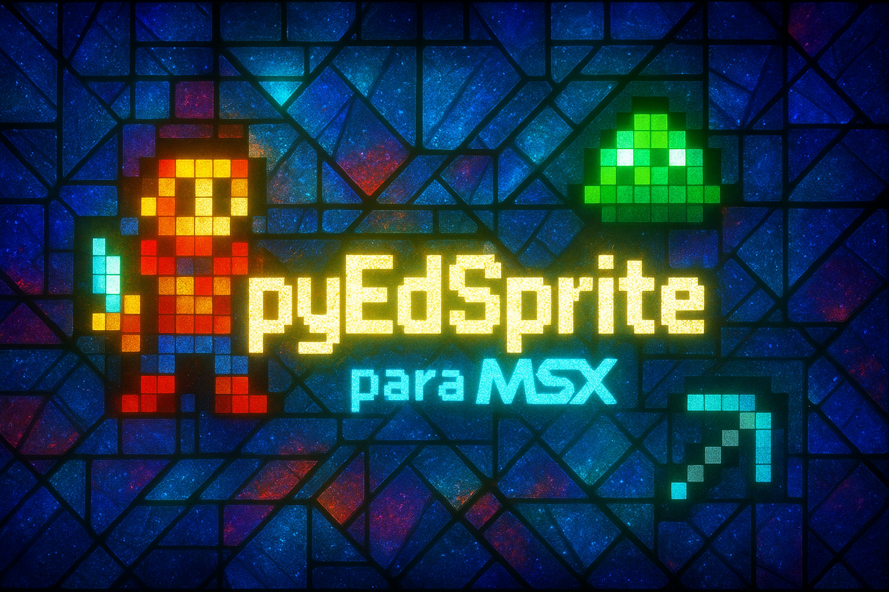

# pyEdSprite

Editor de sprites **MSX1** (estilo **TMS9918A**) feito em **Python** com interface gráfica (**Tkinter + CustomTkinter**), pensado como um MVP simples e direto: desenhe sprites **8x8** ou **16x16**, escolha a cor (**1 cor por sprite**, como no MSX1), visualize miniaturas em grade, edite com ferramentas e salve tudo em **SQLite** (`sprites.db`).

---

## Splashscreen

> Observação: o projeto tenta carregar `splashscreen.jpg` primeiro, mas sem bibliotecas extras o Tk normalmente suporta melhor **PNG**.
> Por isso, `splashscreen.png` funciona “out of the box”.

---

## Interface do usuário (exemplo)

---

## Ideia do projeto

O MSX1 trabalha com sprites com limitações bem específicas (tamanho fixo, **1 cor por sprite**, paleta reduzida, e composição de sprites maiores por blocos). Este projeto nasceu para facilitar:

- criar e editar sprites rapidamente;
- montar sprites maiores a partir de blocos (2x2);
- simular composição por “camadas” (overlay);
- ter ferramentas básicas de desenho (linha, formas, pincéis);
- aplicar deslocamentos úteis (wrap/buffer) e desfazer;
- manter projetos salvos localmente sem complicação (SQLite).

---

## Funcionalidades (até o momento)

### Tamanhos / paleta
- **Tamanhos de sprite:** `8x8` e `16x16`
- **Paleta MSX1 (16 cores):** seleção por índice `0..15`
  - Observação: o índice `0` costuma ser “transparente” em MSX; aqui é exibido como preto para visualização.

### Grade / preview
- **Grade de sprites com miniaturas** (seleção por clique)
- **Editor com grid** (visualização ampliada)
- **Preview 2x** do sprite (ou composição, conforme modo)

### Persistência (SQLite)
- **Salvar projeto em SQLite** (`sprites.db`)
- **Carregar projeto** por lista (com preview do primeiro sprite)

### Pincéis
- Seleção de pincel por lista (padrões + salvos)
- **Editor de pincel** (até **8x8**) com:
  - formas rápidas: **Quadrado**, **Retângulo**, **Redondo** (elipse/círculo)
  - modo **Personalizado** (clique para ligar/desligar células)
  - ações: **Preencher**, **Limpar**, **Inverter**
- **Salvar pincel** no SQLite (tabela `brushes`)

### Ferramentas de desenho
As ferramentas respeitam:
- **Botão esquerdo:** desenha (liga pixel)
- **Botão direito:** apaga (desliga pixel)

Ferramentas disponíveis:
- **Pincel (brush):** clique e arraste
- **Borracha:** clique e arraste (com forma/tamanho configuráveis)
- **Preencher área (FILL / balde):** clique para preencher a **região conectada** (4-direções) de pixels com o mesmo valor:
  - Clique em uma área vazia (`0`) com botão esquerdo para preencher com `1` até encontrar o “contorno” (pixels ligados).
  - Clique com botão direito para fazer o inverso (apagar uma região conectada de `1`).
- **Reta:** clique início → mova → clique fim (com preview)
- **Retângulo (contorno):** clique início → mova → clique fim
- **Retângulo preenchido:** clique início → mova → clique fim
- **Elipse/Círculo (contorno):** clique início → mova → clique fim
- **Elipse/Círculo preenchido:** clique início → mova → clique fim

### Deslocamento (Shift) + Undo
Na barra do editor existem controles de deslocamento com 2 modos:

#### 1) `wrap` (rotacionar)
- O que “sai” de um lado **entra do outro** (wrap-around).
- Suporta: esquerda/direita/cima/baixo.

#### 2) `buffer` (deslocar com memória)
- O que “sai” **não volta automaticamente**; entra `0` (vazio) no lado oposto.
- Porém, as linhas/colunas removidas ficam guardadas em **buffers por direção** (por sprite).
- Ao deslocar no **sentido oposto**, o conteúdo pode **voltar** (LIFO).
- Capacidade do buffer:
  - **8x8:** guarda até **8** linhas/colunas
  - **16x16:** guarda até **16** linhas/colunas

#### Desfazer (undo)
- Botão **Desfazer** com **1 nível**
- Restaura o sprite para o estado imediatamente anterior (bitmap, cor e buffers do modo `buffer`).

---

## Modos de operação

### 1) `single`
Edita **um sprite por vez** (o selecionado na grade).

### 2) `2x2`
Edita um bloco **2x2** de sprites adjacentes como se fosse um sprite maior:
- Para sprites `8x8`: edita uma área total `16x16` (2x2 sprites 8x8)
- Para sprites `16x16`: edita uma área total `32x32` (2x2 sprites 16x16)

> Dica: nas bordas da grade pode não existir um bloco 2x2 válido; selecione um sprite “mais para dentro” da grade.

### 3) `overlay`
Empilha visualmente 4 sprites (bloco 2x2) na mesma área **(mesmo tamanho do sprite)**:
- O preview mostra a composição das 4 “camadas”
- Você escolhe qual camada editar (1 a 4) no seletor “Overlay: editar sprite”
- Deslocamento/undo também respeitam a camada ativa (no modo overlay)

---

## Como os dados são organizados

- O projeto mantém uma lista de sprites em memória.
- Cada sprite guarda:
  - `size` (8 ou 16)
  - `color_index` (0..15)
  - `rows` (máscaras de bits por linha)
- Ao salvar:
  - Cria/atualiza um registro do projeto
  - Armazena cada sprite como **BLOB** no SQLite:
    - `8x8`: 8 bytes (1 byte por linha)
    - `16x16`: 32 bytes (2 bytes por linha)
- Pincéis (brushes) são armazenados na tabela `brushes` com máscara em BLOB (até 8x8).

---

## Requisitos

- **Python 3.14+**
- Biblioteca padrão:
  - `tkinter` (GUI)
  - `sqlite3` (persistência)
- Dependências externas:
  - `customtkinter`
  - `pillow` (listado em `requirements.txt`, mas a splashscreen atual funciona sem Pillow usando `tk.PhotoImage`)

---

## Como executar

Crie/ative um ambiente virtual e instale dependências:
bash pip install -r requirements.txt
Depois:
bash python main.py
----
## Notas rápidas de uso

- **Botão esquerdo** desenha e **botão direito** apaga (em qualquer ferramenta).
- Ferramentas de forma (reta/retângulo/elipse) funcionam com **2 cliques** (início e fim) e mostram **preview** em branco.
- Use `wrap` para “rolar” o sprite, e `buffer` para empurrar e poder “trazer de volta” ao deslocar no sentido contrário.
